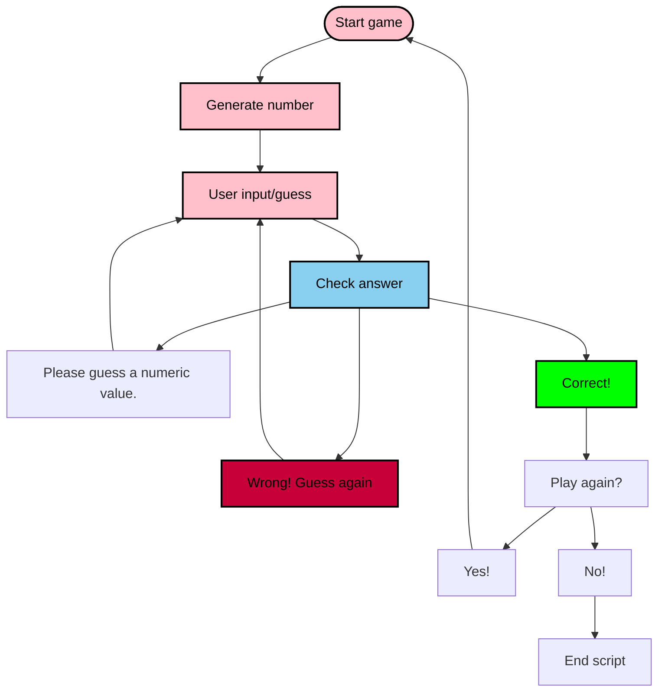

```mermaid
flowchart TD
classDef pink fill:#FFC0CB, stroke:#000000, stroke-width: 2px, color:#000000
classDef blue fill:#89CFF0, stroke:#000000, stroke-width: 2px, color:#000000
classDef green fill:#00FF00, stroke:#000000, stroke-width: 2px, color:#000000
classDef red fill:#C70039, stroke:#000000, stroke-width: 2px, color:#000000
STR([Start game]):::pink
STR --> RNG[Generate number]:::pink
RNG --> UI[User input/guess]:::pink
UI --> CH[Check answer]:::blue
CH --> NNM[Please guess a numeric value.] --> UI
CH ---> N[Wrong! Guess again]:::red
N --> UI
CH --> Y[Correct!]:::green
Y --> ?
?[Play again?]
? --> Y1[Yes!] --> STR
? --> N1[No!] --> B[End script]

```
